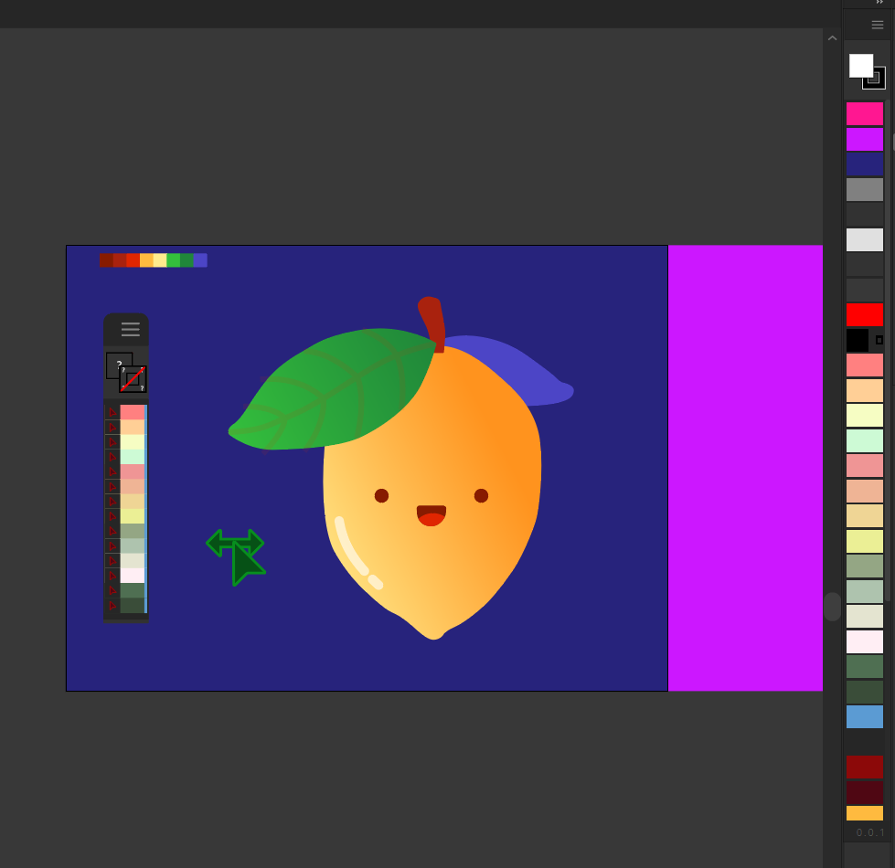

# Warlock

## Modern rebuild of [ProtoColors](https://github.com/Inventsable/protoColors):

> 

> 

## The new version, still in development:

Notice the live panel on the right-hand side, scanning the document of it's own UI animation preview on the [inventsable.cc homepage](https://inventsable.cc).

## Why rebuild?

1. ProtoColors is 5 years old. I've come a long way as a programmer in general, and at the time I didn't know any better but to use constant polling via `setInterval` to scan for colors. As you might imagine, it was really heavy and the performance was awful, but at the time getting anything to work remotely well was enough to keep me going.

2. I hate swatches. I never use them, and I always feel like I want a reliable palette inside of Illustrator showing every color I have in the document, and allowing me to easily swap, select all, or beyond from the same place.

3. Warlock is cutting edge. Bolt-CEP, Typescript, Vue 3 Composition API, Pinia, Vite, and more. This is one of the easiest projects I had in mind when redesigning my site, since the majority could be done over a single weekend and it'd be a good flagship tool to open source and display alongside Checkpoint. I'm wanting to modernize Brutalism and in building out these open source tools, can further refine certain components as I go (like context and flyout menus in this one which are really done not only well but proper) instead of sitting down to design a lot of components for Volt-CEP that I don't have practical means to put to real use.
